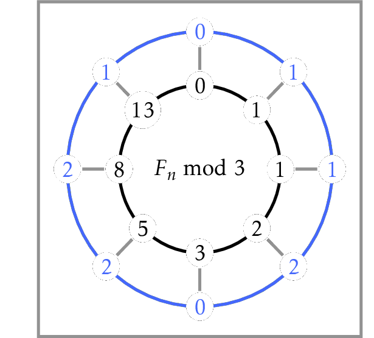
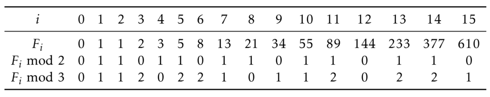
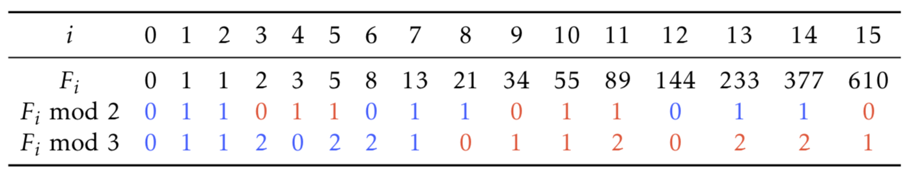

# Fibonacci Number Again

Given two integers $0 \le n \le 10^{18}$ and
$2 \le m \le 10^3$,
compute the $n$-th Fibonacci number modulo $m$.

In this problem, $n$ may be so huge that an algorithm looping for $n$ iterations will be too slow. Therefore we need to avoid such a loop.
To get an idea how to solve this problem without going through all Fibonacci numbers 
$F_i$ for $i$ from $0$ to $n$, 
take a look at the table below:

Do you see any interesting properties of the last two rows in the table above?

Both these sequences are periodic! For $m=2$, the period is $0 1 1$ and has length $3$, while for $m=3$ the period is $0 1 1 2 0 2 2 1$ and has length $8$. 

Therefore, to compute, say, $F_{2015} \bmod{3}$ we just need to find the remainder of $2015$ when divided by $8$. Since $2015=251 \cdot 8 + 7$, we conclude that $F_{2015} \bmod{3} = F_{7} \bmod{3}=1$.

It turns out that for any integer $m \ge 2$, 
the sequence $F_n \bmod{m}$ is periodic. 
The period always starts with $0 1$ and is 
known as *Pisano period* 
(Pisano is another name of Fibonacci).
