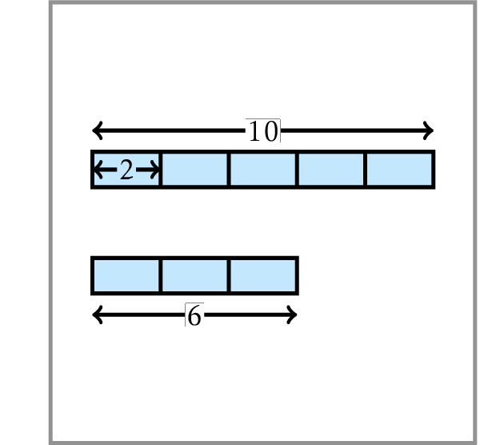

# Greatest Common Divisor

The greatest common divisor 
$\operatorname{GCD}(a,b)$ of two positive 
integers $a$ and $b$ is the largest integer $d$ 
that divides both $a$ and $b$. The solution 
of the Greatest Common Divisor Problem was 
first described (but not discovered!) by 
the Greek mathematician Euclid twenty 
three centuries ago. But the name of 
a mathematician who discovered this algorithm, 
a century before Euclid described it, remains 
unknown. Centuries later, Euclid's algorithm 
was re-discovered by Indian and Chinese astronomers. 
Now, efficient algorithm for computing the greatest 
common divisor is an important ingredient of modern 
cryptographic algorithms. 

Your goal is to implement Euclid's algorithm for computing $\operatorname{GCD}$. 

Implement a function that computes the greatest
common divisor of two integers
$1 \le a, b \le 2 \cdot 10^9$.

