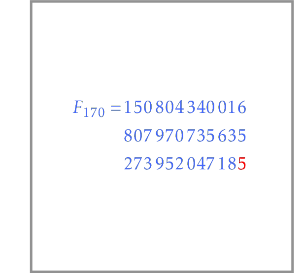

# Last Digit of Fibonacci Number

Implement `last_digit_of_fibonacci_number` function
that takes an integer $0 \le n \le 10^7$ and returns
the last digit of $F_n$.

As usual, after implementing a solution, do the
following:
* Switch to the unit tests file, add a few new
tests to the already implemented ones, and run the
tests.
* If a bug is found, fix it and run the tests again.
* Then, check your solution in PyCharm Edu.
* Finally, uncomment the last few lines in the
source file and submit the solution to Coursera or edX.

Please follow the same steps for all the
forthcoming programming challenges. For them, we will
provide the challenge statement only.

Recall that you need to compute just the last digit of a Fibonacci number. In order to speed up the computation, take every intermediate result modulo 10.

