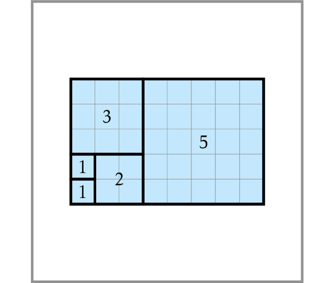

# Last Digit of the Sum of Squares of Fibonacci Numbers

Given $0 \le n \le 10^{18}$,
compute the last digit of $$F_0^2+F_1^2+\dotsb+F_n^2.$$

Since the brute force search algorithm for this problem is too slow ($n$ may be as large as $10^{18}$), we need to come up with a simple formula for $F_0^2+F_1^2+\dotsb+F_n^2$. The figure above represents the sum $F_1^2+F_2^2+F_3^2+F_4^2+F_5^2$ as the area of a rectangle  with vertical side $F_5=5$ and horizontal side $F_5+F_4=3+5=F_6$.
