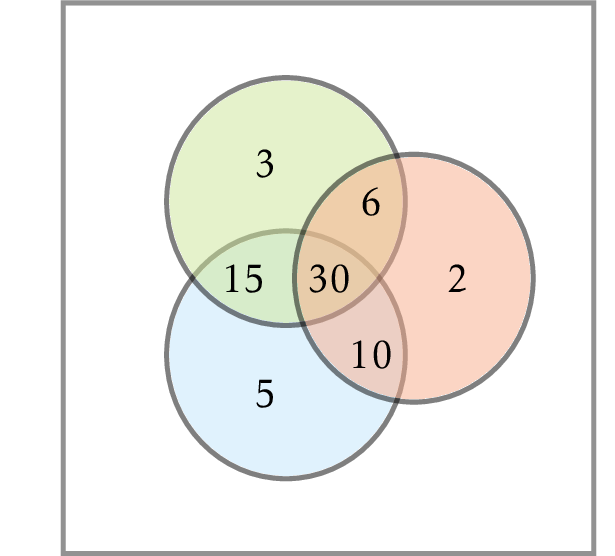

# Least Common Multiple

The least common multiple 
$\operatorname{LCM}(a,b)$ of two positive 
integers $a$ and $b$ is the smallest 
integer $m$ that is divisible by both $a$ and $b$. 

How $\operatorname{LCM}(a,b)$ is related to 
$\operatorname{GCD}(a,b)$?

Compute the least common multiple
of two integers
$1 \le a, b \le 2 \cdot 10^9$.
