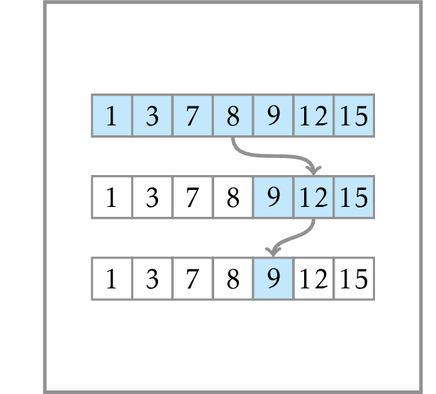

# Binary Search

**Input:** A sorted array $K=[k_0, \dotsc, k_{n-1}]$ 
of $1 \le n \le 3 \cdot 10^4$ distinct integers and
an array $Q=\{q_0,\dotsc,q_{m-1}\}$ of 
$1 \le m \le 10^5$ integers.

**Output:** For all $i$ from $0$ to $m-1$, 
output an index $0 \le j \le n-1$ such 
that $k_j=q_i$ or $-1$, if there is no such index.
