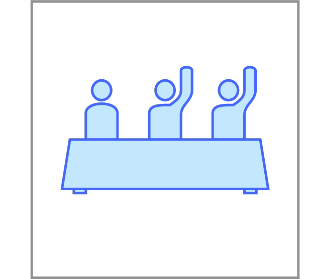

# Majority Element

**Input.** A sequence of $n \le 10^5$ integers.

**Output.** 1, if there is an element 
that is repeated more than $n/2$ times, 
and 0 otherwise.

As you might have already guessed, this problem can be solved by the divide-and-conquer algorithm in time $O(n\log n)$. Indeed, if a sequence of length $n$ contains a majority element, then the same element is also a majority element for one of its halves. Thus, to solve this problem you first split a given sequence into halves and recursively solve it for each half. Do you see how to combine the results of two recursive calls?
