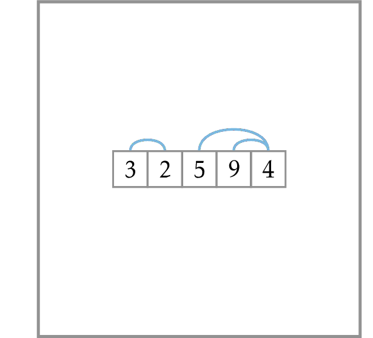

# Number of Inversions

The number of inversions in a sequence measures how close the sequence is to being sorted. For example, a sequence sorted in the non-descending order contains no inversions, while a sequence sorted in the descending order contains $n(n-1)/2$ inversions (every two elements form an inversion).

A naive algorithm for the Number of Inversions Problem goes through all possible pairs $(i,j)$ and has running time $O(n^2)$. To solve this problem in time $O(n\log n)$ using the divide-and-conquer technique split the input array
into two halves and make a recursive call on both halves. What remains to be done is computing the number of inversions formed by two elements from different halves. If we do this naively, this will bring us back to $O(n^2)$ running time, since the total number of such pairs is $\frac{n}{2} \cdot \frac{n}{2}=\frac{n^2}{4}=O(n^2)$. It turns out that one can compute the number of inversions formed by two elements from different halves in time $O(n)$, if both halves are already sorted. This suggest that instead of solving the original problem we solve a more general problem: compute the number of inversions in the given array and sort it at the same time.

Compute the number of inversions in 
a sequence of length at most $30000$.
