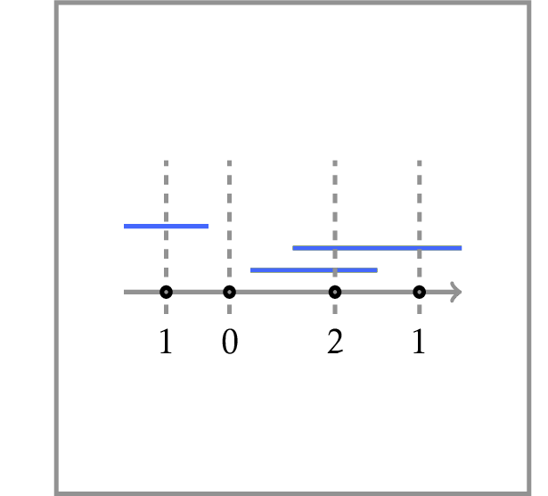

# Points and Segments

You are organizing an online lottery. To participate, a person bets on a single integer. You then draw several segments of consecutive integers at random. A participant’s payoff is proportional to the number of segments that contain the participant’s number. You need an efficient algorithm for computing the payoffs for all participants. A simple scan of the list of all ranges for each participant is too slow since your lottery is very popular: you have thousands of participants and thousands of ranges.

**Input:** A list of $n \le 50000$ segments and 
a list of $m \le 50000$ points.

**Output:** The number of segments 
containing each point.

A detailed solution for this programming challenge is covered in the <a href="http://bit.ly/2MvJBF9">companion MOOCBook</a>. But we strongly encourage you to do your best to solve the challenge yourself before looking into the book! There are at least three good reasons for this.
<ul>
<li>By solving this challenge, you practice solving algorithmic problems similar to those given at technical interviews.</li>
<li>The satisfaction and self confidence that you get when passing the grader is priceless =)</li>
<li>Even if you fail to pass the grader yourself, the time will not be lost as you will better understand the solution from the book and better appreciate the beauty of the underlying ideas.</li>
</ul>

