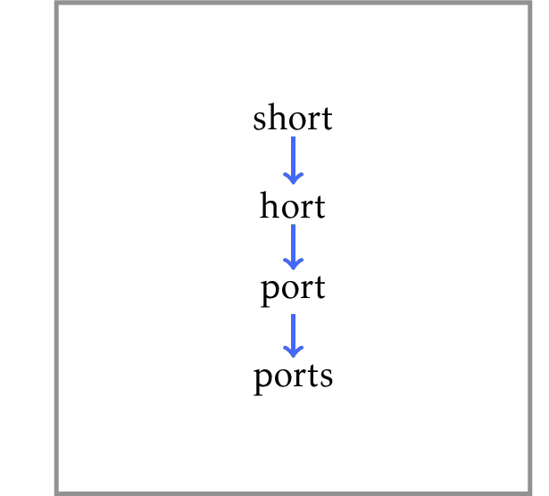

# Edit Distance

Given two strings of length at most 100,
compute the minimum number of single symbol 
insertions, deletions, and substitutions to 
transform one string into the other one.

Edit distance has many applications 
in computational biology, 
natural language processing, 
spell checking, etc. 
For example, biologists often analyze edit 
distances when they  search for 
disease-causing mutations.
