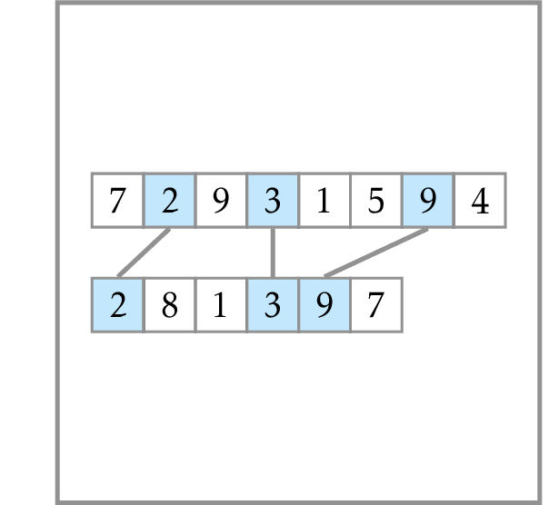

# Longest Common Subsequence of Two Sequences

Compute the longest common subsequence of 
two integer sequences of length at most 100.

Given two sequences 
$A=(a_1, a_2, \dotsc, a_n)$ and 
$B=(b_1, b_2, \dotsc, b_m)$, find the 
length of their longest common subsequence, 
i.e., the largest non-negative integer $p$ such that 
there exist indices
$1 \leq i_1 < i_2 <  \dotsb <  i_p \leq n$ and
$1 \leq j_1 < j_2 <  \dotsb <  j_p \leq m$
such that 
$a_{i_1} = b_{j_1}, \dotsc, a_{i_p} = b_{j_p}$. 
The problem has applications in data comparison 
(e.g., diff utility, merge operation 
in various version control systems), 
bioinformatics (finding similarities 
between genes in various species), and others.
