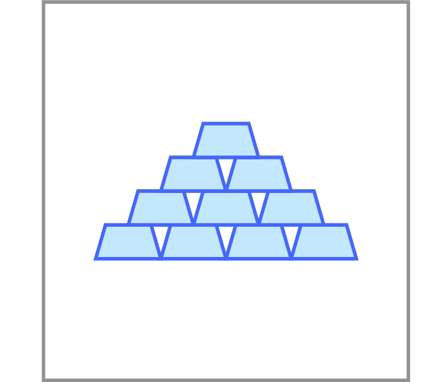

# Maximum Amount of Gold

Given a set of gold bars of various weights 
and a backpack that can hold at most $W$ pounds, 
place as much gold as possible into the backpack.

**Constraints.** $1 \le W \le 10^4$. There are at most 
$10^3$ gold bars, the weight of each gold bar is at 
most $10^5$.

A detailed solution for this programming challenge is covered in the <a href="http://bit.ly/2MvJBF9">companion MOOCBook</a>. But we strongly encourage you to do your best to solve the challenge yourself before looking into the book! There are at least three good reasons for this.
<ul>
<li>By solving this challenge, you practice solving algorithmic problems similar to those given at technical interviews.</li>
<li>The satisfaction and self confidence that you get when passing the grader is priceless =)</li>
<li>Even if you fail to pass the grader yourself, the time will not be lost as you will better understand the solution from the book and better appreciate the beauty of the underlying ideas.</li>
</ul>

 
