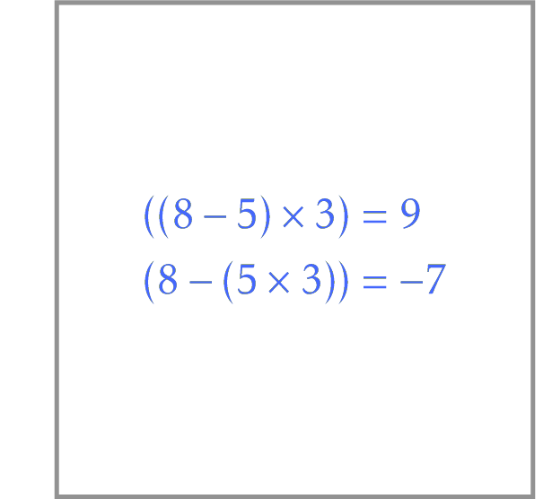

# Maximum Value of an Arithmetic Expression

Parenthesize an arithmetic expression to maxi- mize its value.

**Input.** A string $s=s_0s_1\dotsb s_{2n}$ of length at most 29. 
Each symbol at an even position of $s$ is a digit 
(that is, an integer from 0 to 9) 
while each symbol at an odd position 
is one of three operations from {$+$,$-$,$*$}.

**Output.** The maximum value of the given 
arithmetic expression among all possible 
orders of applying arithmetic operations.
