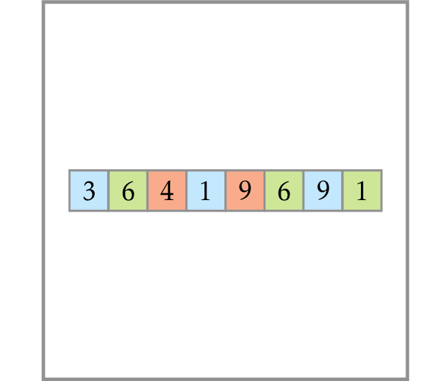

# Partitioning Souvenirs

You and two of your friends have just returned back home after visiting various countries. Now you would like to evenly split all the souvenirs that all three of you bought.

**Input.** A sequence of integers $v_1, v_2, \dotsc, v_n$.

**Output.** Output 1, if it is possible to partition them into three subsets with equal sums. 
Output 0 otherwise.

**Constrains.** $1 \le n \le 20$, $1 \le v_i \le 30$ for all $i$.
