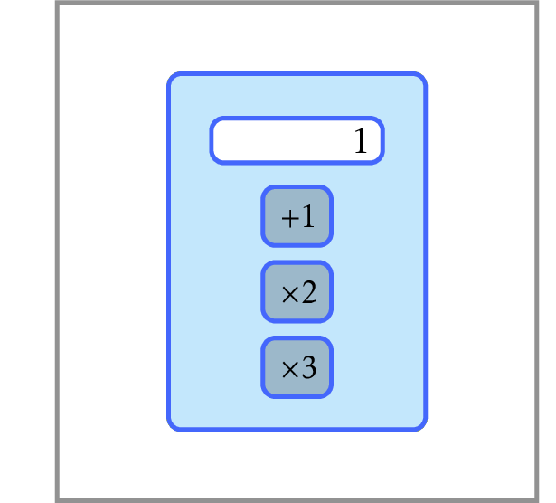

# Primitive Calculator

Find the minimum number of operations 
needed to get a positive integer $n$ from 1 
using only three operations: 
add 1, multiply by 2, and multiply by 3.

**Input.** An integer $1 \le n \le 10^6$.

**Output.** In the first line, output 
the minimum number $k$ of operations needed to 
get $n$ from 1. In the second line, 
output a sequence of intermediate numbers. 
That is, the second line should contain 
positive integers $a_0,a_1,\dotsc,a_k$ 
such that $a_0 = 1$, $a_k = n$, and 
for all $1 \le i \le k$, $a_i$ is equal to 
either $a_{i−1} + 1$, $2a_{i−1}$, or $3a_{i−1}$. 
If there are many such sequences, output any one of them.
