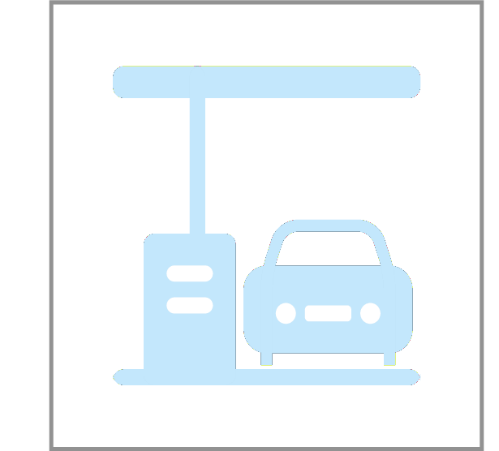

# Car Fueling

Compute the minimum number of tank refills to get from one city to another.

Assuming that the distance between the cities is $1 \le d \le 10^5$ miles,
a car can travel at most $1 \le m \le 400$ miles on a full tank,
and there are $1 \le n \le 300$ gas stations at distances
$stop_1,stop_2,\dotsc,stop_n$ along the way,
output the minimum number of refills needed.
Assume that the car starts with a full tank.
If it is not possible to reach the destination, output −1.
The distances to gas stations satisfy the inequalities
$$0 < stop_1 < stop_2 < \dotsb < stop_n < d .$$
