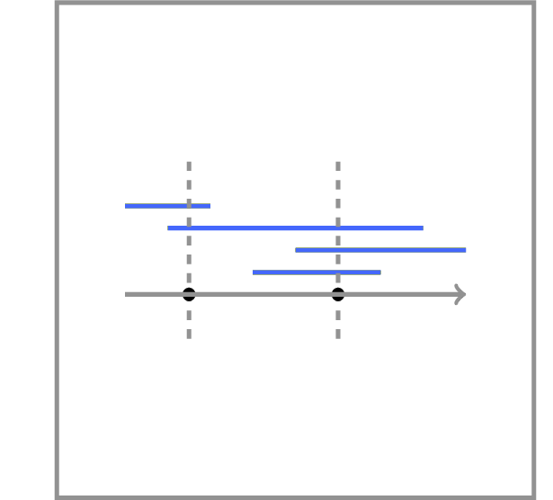

# Collecting Signatures

You are responsible for collecting signatures from all tenants in a building.
For each tenant, you know a period of time when he or she is at home.
You would like to collect all signatures by visiting the building as
few times as possible. For simplicity, we assume that when you enter
the building, you instantly collect the signatures of all tenants that
are in the building at that time.

**Input**: A sequence of $n \le 10^3$ segments
$[l_1,r_1],...,[l_n,r_n]$ on a line.

**Output**: A set of points of minimum size
such that each segment $[l_i,r_i]$ contains a point,
i.e., there exists a point $x$ such that $l_i \le x \le r_i$.

A detailed solution for this programming challenge is covered in the <a href="http://bit.ly/2MvJBF9">companion MOOCBook</a>. But we strongly encourage you to do your best to solve the challenge yourself before looking into the book! There are at least three good reasons for this.
<ul>
<li>By solving this challenge, you practice solving algorithmic problems similar to those given at technical interviews.</li>
<li>The satisfaction and self confidence that you get when passing the grader is priceless =)</li>
<li>Even if you fail to pass the grader yourself, the time will not be lost as you will better understand the solution from the book and better appreciate the beauty of the underlying ideas.</li>
</ul>

