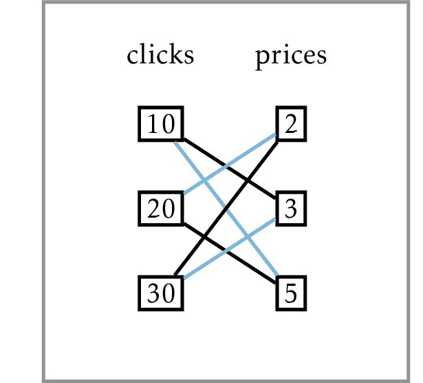

# Maximum Advertisement Revenue

You have $n=3$ advertisement slots on your popular Internet page and 
you want to sell them to advertisers. They expect, respectively, 
${clicks}_1=10$, 
${clicks}_2=20$, and ${clicks}_3=30$ clicks per day. You found three advertisers 
willing to pay ${price}_1=2$, ${price}_2=3$, and ${price}_3=5$ per click. 
How would you pair the slots and advertisers? For example, the blue pairing 
gives a revenue of $10 \cdot 5 + 20 \cdot 2 + 30 \cdot 3 = 180$ dollars, while 
the black one results in revenue of $10\cdot 3 + 20 \cdot 5 + 30 \cdot 2=190$ dollars.

Find the maximum dot product of two
sequences of numbers.
* Input: Two sequences of $n$ positive
integers: $price_1,\dots,price_n$
and $clicks_1,\dots,clicks_n$.
* Output: The maximum value of
$price_1 \cdot c_1 + \dots+price_n \cdot c_n$,
where $c_1,\dots,c_n$ is a
permutation of $clicks_1,\dots,clicks_n$.
