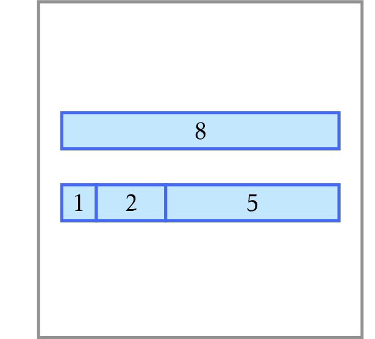

# Maximum Number of Prizes

You are organizing a competition for 
children and have $n$ candies to give as prizes. 
You would like to use these candies for top $k$ places 
in a competition with a restriction that a higher place gets 
a larger number of candies. To make as many children happy 
as possible, you need to find the largest value of $k$ for 
which it is possible.

**Input**: An integer $1 \le n \le 10^9$.

**Output**: The maximum 
number $k$ such that $n$ can be represented as the sum of $k$ pairwise 
distinct positive integers and these integers (if there are many such 
representations, output any of them).
