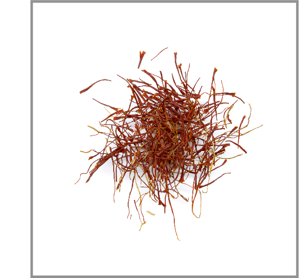

# Maximum Value of the Loot

Given the capacity of a backpack
as well as the weights and per pound prices
of $n$ different compounds, compute the
maximum total price of items that
fit into the backpack of the given capacity.

A thief breaks into a spice shop and finds 
four pounds of saffron, three pounds of 
vanilla, and five pounds of cinnamon. His backpack 
fits at most nine pounds, therefore he cannot 
take everything. Assuming that the prices of 
saffron, vanilla, and cinnamon are 
5000, 200, and 10 per pound respectively, 
what is the most valuable loot in this case? 
If the thief takes $u_1$ pounds of saffron, 
$u_2$ pounds of vanilla, and $u_3$ pounds of cinnamon, 
the total price of the loot is 
$5\,000 \cdot u_1 + 200 \cdot u_2 + 10\cdot u_3$. 
The thief would like to maximize the value of this expression 
subject to the following constraints: 
$u_1 \le 4$, $u_2 \le 3$, $u_3 \le 5$, $u_1+u_2+u_3 \le 9$.
