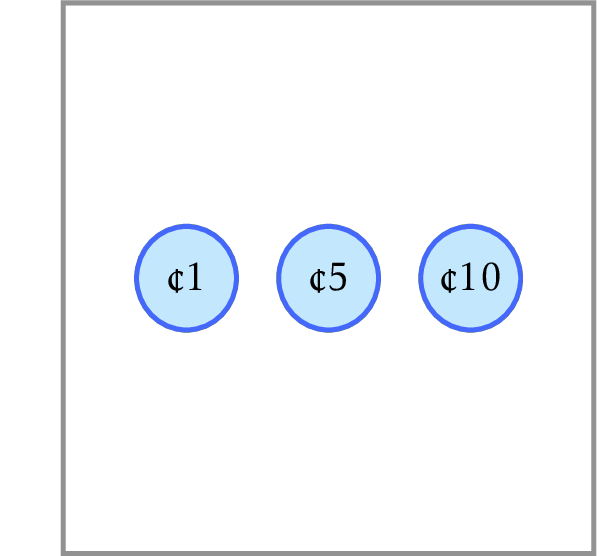

# Money Change

Given an integer $1 \le money \le 10^3$, find
the minimum number of coins with
denominations 1, 5, and 10 that changes $money$.

In this problem, you will implement a simple greedy algorithm used by cashiers all over the world. We assume that a cashier has unlimited number of coins of each denomination.
