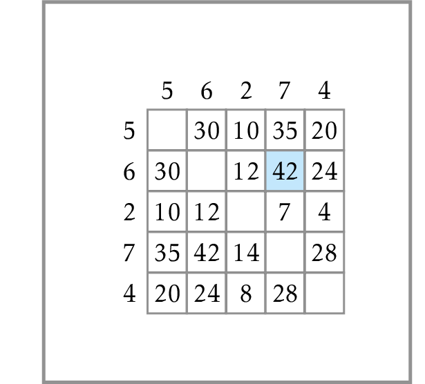

# Maximum Pairwise Product

<center></center>

Given a list $A$ of non-negative integers, find
the maximum product of two distinct elements (that is,
the maximum value of $A[i] \cdot A[j]$ where $i \neq j$;
note that it may be the case that $A[i]=A[j]$).
The length of $A$ is at least 2 and at most $2 \cdot 10^5$,
all elements are non-negative and do not exceed
$2\cdot 10^5$.

# Naive Algorithm

The source file `maximum_pairwise_product.py`
contains an implementation of a naive algorithm
that just goes through all possible pairs. While it is
clearly correct, it is too slow. To enusre this,
make the following experiment. Add the following
three lines to the end of the file:
```
n = 10
A = [0] * n
print(max_pairwise_product_naive(A))
```
This code creates a list $A$ of size
$10$ filled with zeros. It then passes it to the
function `max_pairwise_product_naive` and prints
the result. To see the result, press the green
Run button. It will print the result (0) in the
Run area on blink of an eye. Now, change the value
of $n$ from $10$ to $10^5$ by replacing `10` with
`10**5` and run the resulting program again.
You'll see that it hangs.

# Fast Algorithm

See the materials of the first week at Coursera or edX
to implement a faster algorithm as `max_pairwise_product`
function.

# Testing

After implementing the function `max_pairwise_product`,
start testing your solution. For this, switch to the file
`maximum_pairwise_product_unit_tests.py`. It contains
several unit tests that ensure the correctness of
your program. The function `test_small` checks your
function against a few manually created tests.
The function `test_stress` generates a few short
lists and checks whether your function returns the same
as the naive one. Finally, the function `test_large` checks
your function against massive datasets: the first one
is a list of size $2 \cdot 10^5$ filled in with 4's, the
second one is a list $[0, 1, \ldots, 10^5-1]$.

Add two more unit tests and run it. Ensure that all tests pass.


# Checking Your Solution

When all unit tests pass, check your solution by
pressing the "Check Task" button.


# Submitting to Coursera

When the check is successfull,
submit the source file to Coursera or edX.

<div class='hint'>Use some small list for which you are able to compute the result by hand</div>
