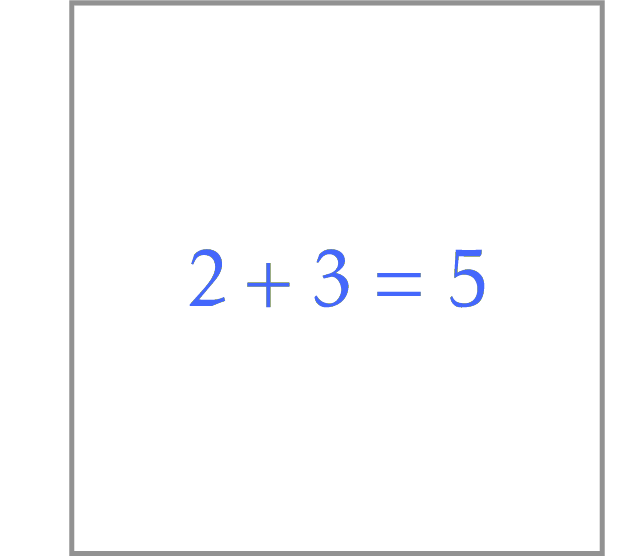

# Welcome!

This course powers our popular
<a href="https://www.coursera.org/specializations/data-structures-algorithms">Data Structures and Algorithms online specialization on Coursera</a>.
We encourage you to sign up for a session and learn
this material while interacting with thousands of
other talented students from around the world.

A particular goal of this framework is to help you to learn how to
write efficient, reliable, and compact Python code. The PyCharm IDE
will make the learning process smooth and enjoyable: it will help
you with testing and debugging as well as structuring and formatting your code.

The assumed pipeline is the following.
For each programming challenge in this course:
<ol>
<li>Design an algorithm, prove that it is correct and has the expected asymptotic behavior.</li>
<li>Implement it in Python here, in PyCharm Edu.</li>
<li>Implement unit tests and stress tests for your solution. If a bug is found, fix it and test again.</li>
<li>By pressing the play button on the right pane, check your solution against a few test cases.</li>
<li>Finally, when you are happy with your implementation, submit to Coursera.
    This will test your solution against dozens of carefully selected tests cases.
    For each test case, the autograding system checks whether your solution is fast enough and
    computes the right result.</li>
</ol>

Enjoy!

# Getting Started

1. We assume that you are already familiar
with basic Python programming. To refresh
your Python skills, you may want to take an
Introductory Python course here
(File -> Browse Courses).

2. To get familiar with PyCharm Edu, 
take a look at the 
<a href="https://www.jetbrains.com/help/pycharm-edu/student-s-guide.html">Start Guide</a>.

3. The <a href="http://bit.ly/2ETCmR6">companion MOOCBook</a> contains
detailed statements of all 30 programming challenges
from this course as well as good programming practices
and solutions for selected problems.

# Programming Challenge: Sum of Two Digits

## Implementing a Solution
Implement the `compute_sum` function that takes two digits (that is,
integers in the range from 0 to 9) and returns the sum of these two digits.

We start from this ridiculously simple problem to show you the
pipeline of designing an algorithm,
implementing it, testing and debugging your program, and
submitting it to the grading system.

For this trivial problem, we will skip “Designing an algorithm” and "Implementing"
steps and will move to testing.

## Testing
Switch to the file `sum_of_two_digits_unit_tests.py`.
It contains unit tests for your implementation. If
you haven't heard about unit testing before, we
encourage you to read about it in 
<a href="https://docs.python.org/3/library/unittest.html">this official 
doc article</a>
or to take a short course here, in PyCharm Edu
(through File -> Browse Courses).

For this starting programming challenge, we've already
implemented everything for you. Press the green "Execute"
button in the top left corner of the source file to run the
tests and make sure that all tests pass successfully.

In this challenge, the space of all possible inputs
is so small that it is possible to check just all possible
test cases: the `test_all_inputs` method goes through all
pairs $0 \le a, b \le 9$.

## Checking Your Implementation
When all unit tests pass successfully, press the "Check task"
button in the top part of this pane.

## Submitting to Coursera
When the check is successful, submit the `sum_of_two_digits.py`
file to Coursera.

Just type "first_digit + second_digit"

